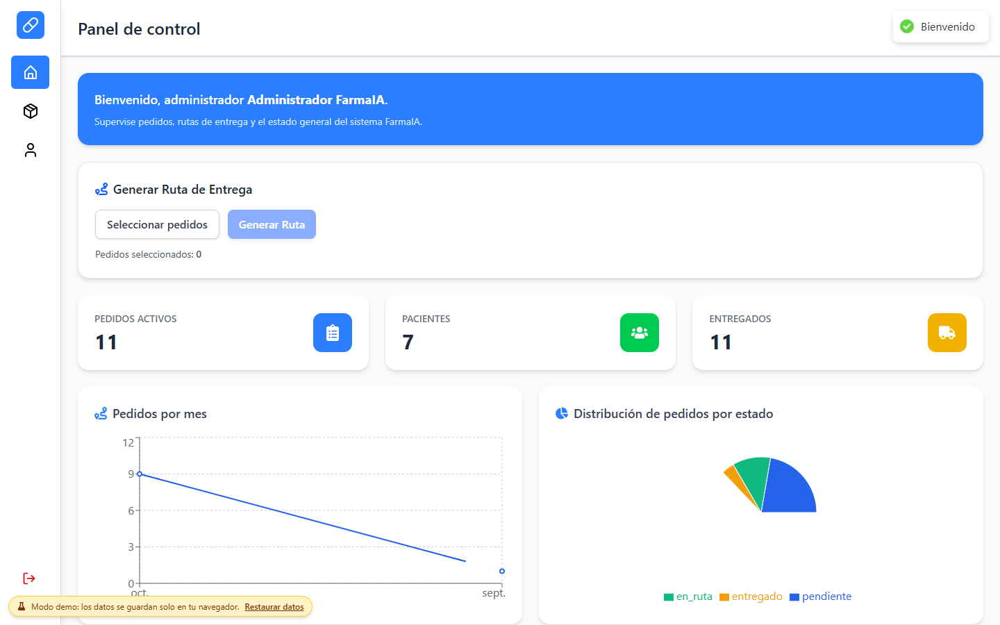
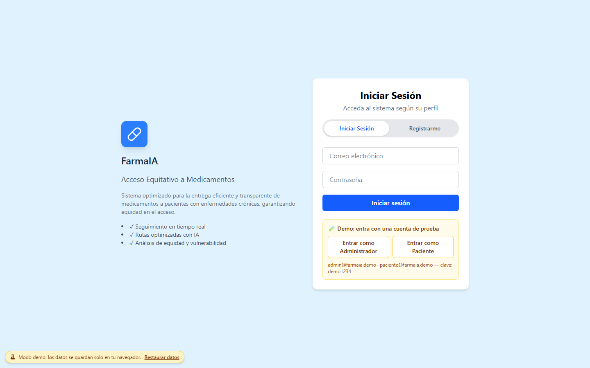
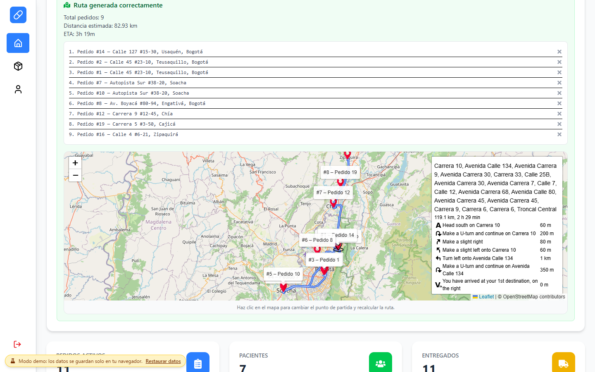
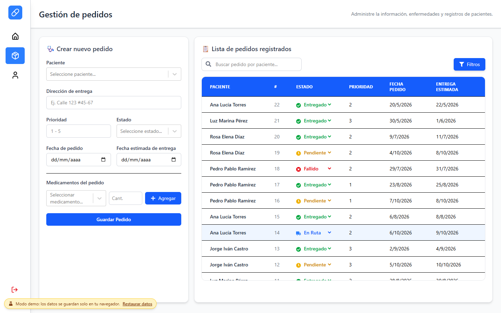
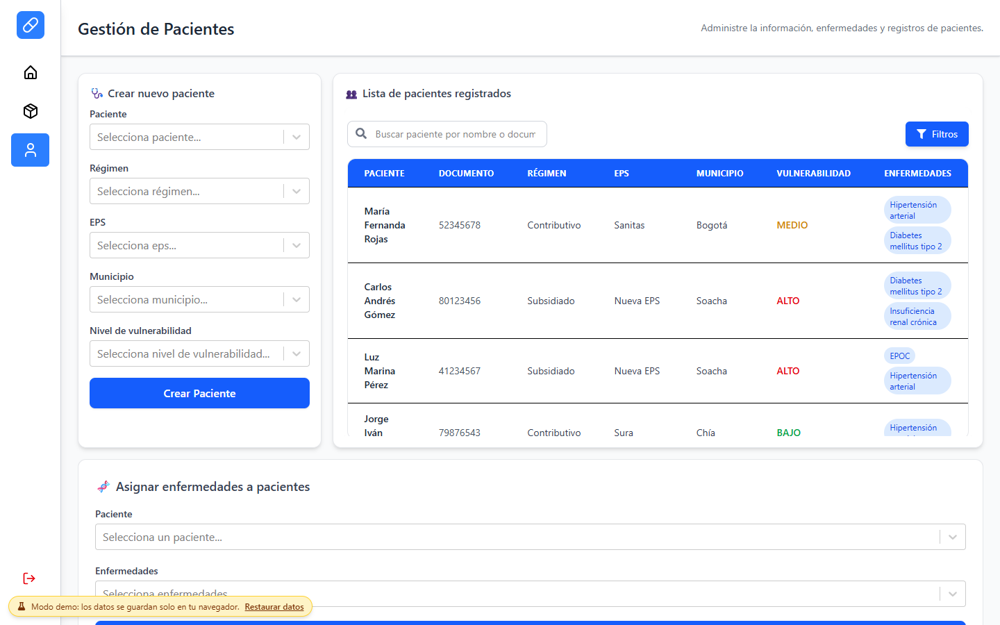
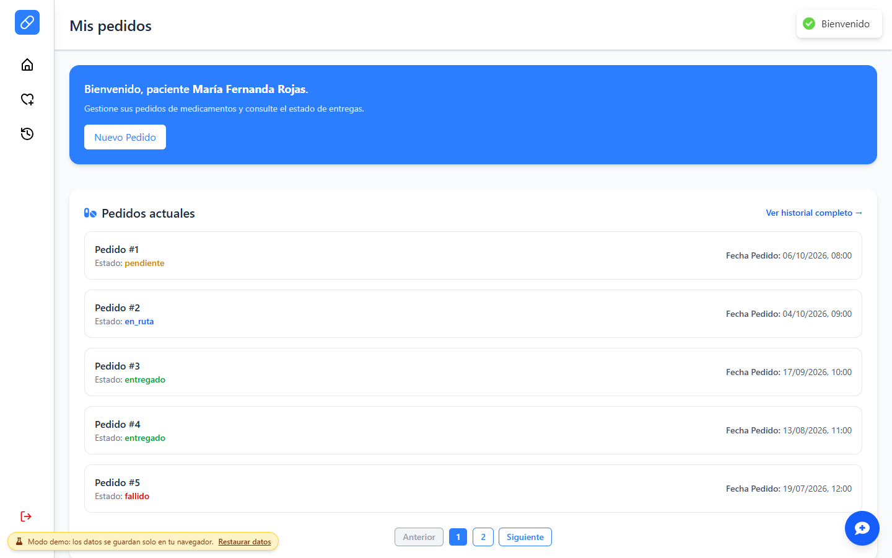
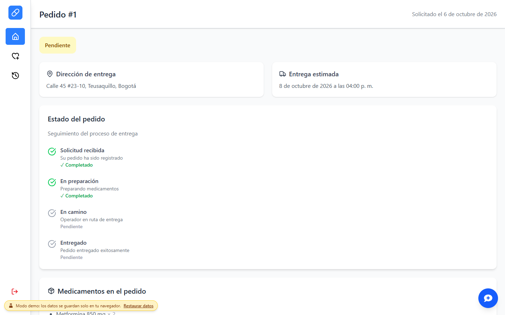
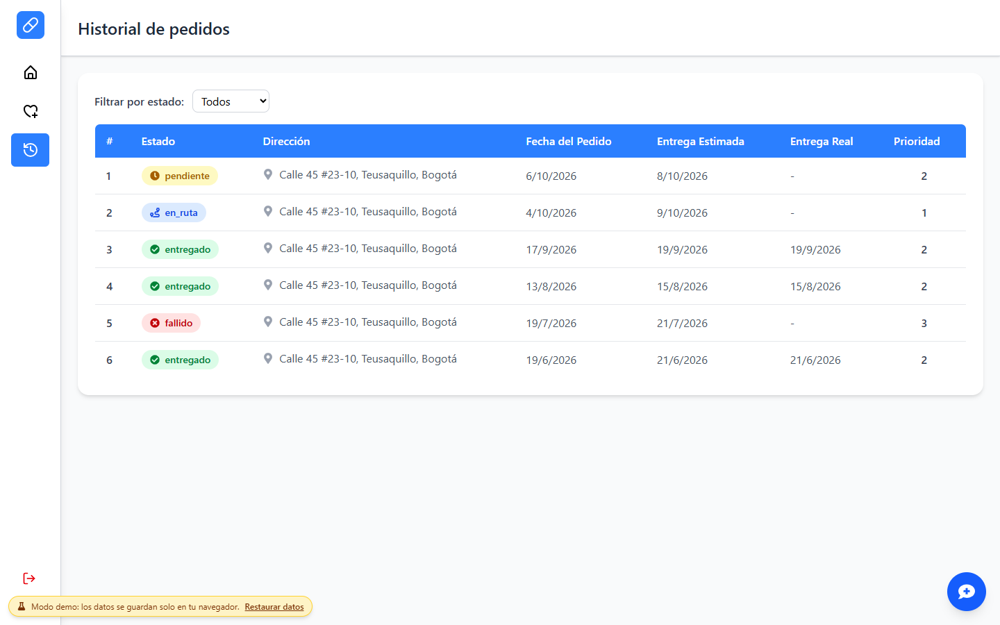
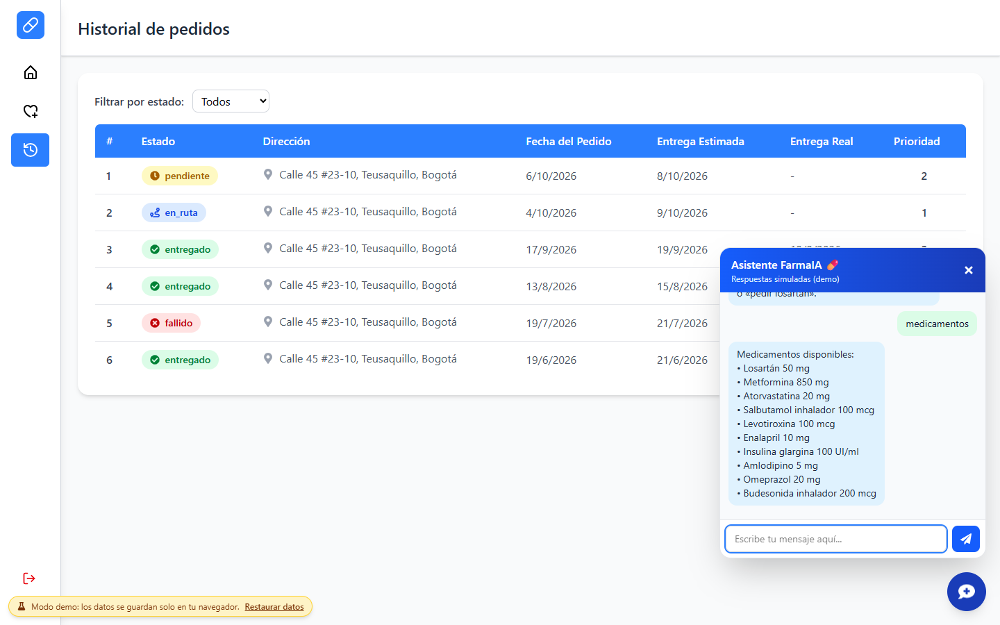
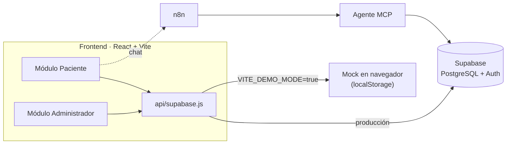

<div align="center">

# 💊 FarmaIA

**Acceso equitativo a medicamentos para pacientes con enfermedades crónicas**

Sistema de gestión farmacéutica desarrollado en **SENASoft 2025** por el equipo **PowerLead**.

[](https://cabrales16.github.io/FarmaIA/)




</div>

---

## 📑 Contenido

- [Descripción general](#-descripción-general)
- [Demo en vivo](#-demo-en-vivo)
- [Galería](#-galería)
- [Arquitectura](#-arquitectura-del-proyecto)
- [Agente de IA (MCP)](#-integración-con-inteligencia-artificial-agente-mcp)
- [Estructura del proyecto](#-estructura-del-proyecto)
- [Instalación y ejecución local](#-instalación-y-ejecución-local)
- [Despliegue](#-despliegue)
- [Futuras mejoras](#-futuras-mejoras)
- [Equipo](#-powerlead---equipo)

## 📌 Descripción general

El <b>Sistema de Gestión Farmacéutica</b> es un aplicativo web diseñado para optimizar la comunicación y gestión de pedidos de medicamentos entre pacientes y administradores de entidades médicas.

El sistema permite:

👩‍⚕️ <b>Pacientes</b>:

- Solicitar medicamentos a domicilio.
- Consultar el estado y progreso de sus pedidos en tiempo real.
- Acceder a su historial de órdenes y tratamientos.

🧑‍💼 <b>Administradores</b>:

- Gestionar información de pacientes.
- Controlar pedidos, inventarios y entregas.
- Administrar datos de la entidad médica mediante un panel seguro.

## 🎮 Demo en vivo

👉 **https://cabrales16.github.io/FarmaIA/**

La demo es **100 % funcional y no necesita backend**: se ejecuta íntegramente en el navegador con un servidor simulado (`src/mock`) que imita la API de Supabase y guarda los cambios en `localStorage`. Puedes crear pedidos, cambiar estados, registrar usuarios y generar rutas; tus cambios solo existen en tu navegador y puedes restaurarlos en cualquier momento con **«Restaurar datos»** (esquina inferior izquierda).

| Perfil | Correo | Contraseña |
|---|---|---|
| 🧑‍💼 Administrador | `admin@farmaia.demo` | `demo1234` |
| 👩‍⚕️ Paciente | `paciente@farmaia.demo` | `demo1234` |

> En la pantalla de inicio hay botones de acceso rápido para ambos perfiles. También puedes pulsar **Registrarme** para crear tu propia cuenta de paciente.

**Qué probar**

| Como administrador | Como paciente |
|---|---|
| Ver KPIs y gráficos en el panel de control | Ver tus pedidos y abrir el detalle con seguimiento y mapa |
| Seleccionar pedidos y **generar una ruta optimizada** (NN + 2-opt), con mapa y descarga GPX | Crear un **nuevo pedido** eligiendo medicamentos y ubicación en el mapa |
| Crear pedidos y **cambiar su estado** desde la tabla | **Confirmar la recepción** de un pedido en ruta |
| Dar de alta pacientes y asignarles enfermedades crónicas | Consultar el historial con filtros |
| Filtrar pacientes por EPS, régimen, municipio o enfermedad | Hablar con el **asistente virtual** («medicamentos», «mis pedidos», «pedir losartán») |

> **Nota:** el asistente de la demo es un simulador por reglas. El agente real (n8n + MCP + IA) requiere servicios externos; ver [más abajo](#-integración-con-inteligencia-artificial-agente-mcp).

## 🖼️ Galería

| Inicio de sesión | Rutas optimizadas |
|:---:|:---:|
|  |  |
| **Gestión de pedidos** | **Gestión de pacientes** |
|  |  |
| **Mis pedidos (paciente)** | **Detalle de un pedido** |
|  |  |
| **Historial** | **Asistente virtual** |
|  |  |

## 🧩 Arquitectura del Proyecto

El proyecto sigue una arquitectura <b>modular</b>, <b>escalable</b> y <b>basada en servicios</b>, con integración de herramientas de automatización e infraestructura en la nube.



### 🧱 Frontend

- <b>Framework</b>: React + Vite ⚡
- <b>Lenguaje</b>: JavaScript (JSX)
- <b>Estilos</b>: TailwindCSS
- <b>Gestión de estados</b>: Context API
- <b>Mapas y rutas</b>: Leaflet + OSRM, optimización propia (vecino más cercano + 2-opt)
- <b>Comunicación con backend</b>: SDK de Supabase (REST + Auth)

### ⚙️ Backend

- <b>Base de datos</b>: PostgreSQL
- <b>Plataforma backend-as-a-service</b>: Supabase (API REST automática, autenticación, almacenamiento)
- <b>Flujos automatizados</b>: n8n

    - Creación y actualización de pedidos.
    - Notificaciones automáticas.
    - Conexión con el <b>agente inteligente (MCP)</b>.

### ☁️ Infraestructura y despliegue
- <b>GitHub Pages</b> → Demo pública del frontend (modo demo, sin backend).
- <b>Render</b> → Hosting del frontend en producción.
- <b>Supabase</b> → Hosting del backend y base de datos.
- <b>Docker</b> → Contenedorización y gestión del entorno de desarrollo.
- <b>GitHub</b> → Control de versiones y colaboración.
- <b>JIRA</b> → Documentación y gestión de incidencias.

## 🤖 Integración con Inteligencia Artificial (Agente MCP)

El sistema incluye un <b>agente inteligente</b> integrado a través del <b>Model Context Protocol (MCP)</b> y orquestado mediante <b>n8n</b>.

Este agente se comunica con Supabase y otros servicios para <b>automatizar procesos y generar información contextualizada</b> para cada usuario.

### 🧠 Funcionalidades del MCP

- Procesamiento de solicitudes provenientes de n8n.
- Priorización inteligente de pedidos.
- Acceso a datos de pacientes y medicamentos desde Supabase.
- Ejecución de prompts personalizados mediante un cliente MCP local.

<b>Configuración técnica</b>:

- Cliente MCP basado en Node.js.
- Comunicación mediante stdio.
- Prompt principal: mcp/prompts/main.prompt.
- Variables sensibles gestionadas en .env (no versionadas por seguridad).

> El cliente MCP y los flujos de n8n viven fuera de este repositorio (solo el widget de chat está aquí). La URL del webhook se configura con `VITE_N8N_WEBHOOK_URL`.

## 🗂️ Estructura del Proyecto

```
src/
│
├── Admin/           # Vistas y componentes para administradores
├── Landing/         # Página de inicio y bienvenida
├── Paciente/        # Módulos y vistas para pacientes
├── Protected/       # Rutas protegidas (autenticación)
│
├── api/             # Cliente de datos: Supabase real o mock según el modo
├── mock/            # Backend simulado de la demo (cliente, datos semilla, chat, banner)
├── assets/          # Recursos estáticos (iconos, imágenes)
├── common/          # Componentes compartidos (router, geo/TSP, eventos de datos)
├── context/         # Context API y estados globales
│
├── App.jsx          # Punto de entrada principal de React
├── main.jsx         # Configuración y renderizado raíz
├── index.css        # Estilos globales
└── App.css          # Estilos del componente principal
```

## 🚀 Instalación y Ejecución Local
### 🧰 Requisitos previos

- Node.js `>= 18`
- Docker (opcional, recomendado para entorno de desarrollo)
- Cuenta en <b>Supabase</b> (no necesaria en modo demo)
- Variables de entorno configuradas (`.env`)

### 🔧 1. Clonar el repositorio

```bash
git clone https://github.com/Cabrales16/FarmaIA.git
cd FarmaIA
```

### 📦 2. Instalar dependencias

```bash
npm install
```

### ⚡ 3a. Modo demo (sin backend)

```bash
npm run dev:demo
```

Abre http://localhost:5173/FarmaIA/ y entra con las [cuentas de la demo](#-demo-en-vivo).

### ⚙️ 3b. Modo completo (con Supabase)

Copia `.env.example` a `.env` y completa tus valores:

```bash
VITE_SUPABASE_URL=https://xxxx.supabase.co
VITE_SUPABASE_ANON_KEY=public-anon-key
# Opcionales
VITE_N8N_WEBHOOK_URL=https://tu-instancia.app.n8n.cloud/webhook/<id>/chat
VITE_DEPOT_LAT=4.7110
VITE_DEPOT_LNG=-74.0721
```

Luego:

```bash
npm run dev
```

La aplicación estará disponible en http://localhost:5173

### 🐳 4. (Opcional) Ejecutar con Docker

```bash
docker build -t gestion-farmaceutica .
docker run -p 8080:80 gestion-farmaceutica
```

La imagen sirve el build estático con Nginx en http://localhost:8080

### 📜 Scripts disponibles

| Script | Descripción |
|---|---|
| `npm run dev` | Servidor de desarrollo contra Supabase |
| `npm run dev:demo` | Servidor de desarrollo en modo demo |
| `npm run build` | Build de producción |
| `npm run build:demo` | Build de la demo (base `/FarmaIA/`, datos simulados) |
| `npm run preview:demo` | Sirve localmente el build de la demo |
| `npm run lint` | Análisis estático con ESLint |

## 🧩 Despliegue

### GitHub Pages (demo)

El workflow [`deploy-demo.yml`](.github/workflows/deploy-demo.yml) ejecuta lint, construye la demo con Vite y la publica en cada push a `main` con el pipeline oficial de **Jekyll** de GitHub Pages (que aquí solo entrega los archivos estáticos de `dist/`).

1. En el repositorio: **Settings → Pages → Source: GitHub Actions**.
2. Haz push a `main` (o ejecuta el workflow desde la pestaña *Actions*).
3. La demo queda en `https://<usuario>.github.io/<repositorio>/`.

> Si el repositorio no se llama `FarmaIA`, ajusta `base` en [`vite.config.js`](vite.config.js).

La demo usa `HashRouter`, por lo que las rutas tienen la forma `#/inicio/...` y no hacen falta redirecciones en el servidor.

### Producción (Render)

El despliegue está automatizado mediante <b>Render</b>.

Los pasos generales para un nuevo despliegue son:

1. Conectar el repositorio de GitHub a Render.
2. Configurar variables de entorno desde el panel de Render.
3. Render detectará el `vite.config.js` y ejecutará el build automáticamente.
4. Verifica el estado del servicio desde el panel.

## 🧾 Documentación y Gestión de Proyecto

| Herramienta         | Uso                                                                 |
|----------------------|---------------------------------------------------------------------|
| **GitHub**           | Control de versiones, *pull requests*, CI/CD                        |
| **JIRA**             | Documentación de requerimientos, seguimiento y *sprints*           |
| **Supabase Studio**  | Visualización y gestión de base de datos                            |
| **n8n Dashboard**    | Automatización de flujos y agentes                                  |
| **Render Dashboard** | Despliegue y monitoreo de frontend                                  |

## 🧠 Futuras Mejoras

- Implementación de módulo de repartidores con cálculo de rutas óptimas mediante IA.
- Dashboard analítico para métricas médicas.
- Sistema de notificaciones push y alertas de medicación.
- Integración con sistemas de facturación y prescripción electrónica.

## 👥 Colaboradores y Créditos

Proyecto desarrollado en el marco de <b>SENASoft 2025</b> por el equipo <b>PowerLead</b>.
Se priorizó la creación de soluciones inclusivas y accesibles para poblaciones vulnerables.

## 🤖 PowerLead - Equipo
El equipo esta conformado por tres (3) integrantes desarrolladores de <b>FarmaIA</b>:
- Lisseth Monsalve
- Jorge Porras
- Andrés Cabrales
